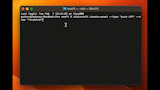

# Chaincraft: Empowering Creators in the NFT World

- 👉 [Watch Demo]()
- 👉 [Read Article on Medium]()

The Chaincraft project was created for the Greenhouse Hackathon 3 **with the goal of making it easier for new developers and non-developers** to interact with Non-Fungible Tokens (NFTs).

`This project aims to provide a solution that would allow anyone to bring their creative ideas to life on the algorand blockchain`.

With a powerful `web-based interface` and `CLI`, Chaincraft delivers on that promise. So whether you're a seasoned developer or a curious creator, Chaincraft offers you the tools you need to create and update unique and collectible NFTs on the Algorand blockchain.

## Chaincraft CLI

For developers, Chaincraft offers a command line tool with a colored interface. This tool, known as the Chaincraft CLI, allows for the creation and updating of Algorand assets from the terminal. The CLI provides a potentially powerful and efficient way for developers to interact with the Algorand network.

<!--  -->

[See instructions for CLI]()

## Chaincraft Web

The Chaincraft web allows non-developers to create assets on a dashboard, simply by signing into their Chaincraft wallet (powered by Morty wallet). The user-friendly interface makes it easy for anyone to create NFTs on the Algorand blockchain.

[See instructions for Web]()

## Support for ARC3 and ARC69

Chaincraft supports both ARC3 and ARC69 asset standards in Algorand. The ARC3 asset URL leads to the metadata, which is pinned on IPFS, while the ARC69 assets URL leads to the media file, also pinned on IPFS. The ARC69 standard contains a manager's address, which allows for mutability of asset standards in Algorand.

[Read more]()

## Limitations

Please note that the first version of Chaincraft is built to support media or NFTs of image mimetypes (png, jpeg, etc). The development team is working on adding support for other file types in future releases.

### Links

- [Medium]()
- [Website]()
- [Youtube]()

### References

### Contributors

- @AC_godson
- @cgold54
- @Stacy
